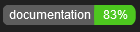

# AngularScreenRecording

An Angular Single Page Application written in a reactive way for screen recording. Supports video and audio recording, exports in `.webm` format.

Privacy guaranteed. Works locally in your browser, no web requests, no data sharing.

Recommended browser: Chrome / Edge / Opera
Firefox doesn't support the Window: showOpenFilePicker() method.

Check it out [here](https://gogo3011.github.io/angular-screen-recording/)

## Technologies used
 - Typescript 5.4.2
 - Angular 17.3.0
 - RxJS 7.8.0
 - PrimeNG/Prime Flex
 - Local Storage as a quick JSON database
 - Origin private file system (OPFS)/FileSystem API for storing/saving/exporting of the recorded videofiles
 - MediaDevices API for capturing the devices screen

## Documentation

Dev documentation done with JSDoc comments in the code. Browse here:  [Documentation](https://gogo3011.github.io/angular-screen-recording/documentation/)

## Workflow
A user starts a recoring by pressing the recording button in the bottom right corner. This initializes a MediaDevices request for sharing a screen. The user can choose wherever to record his whole screen or a specific app/tab and if he needs system audio in the recording.

Recording can be stopped by either stopping the screenshare or pressing the recording button (now red) in the bottom right corner.

The recorded blobs get exported to a `webm` file in the OPFS and a JSON object containing metadata gets persisted in the clients local storage.

Past recordings can be previewed in the app and exported using the FileSystem API to a location in the clients filesystem with a press of a button.

## Further reading
 - [Origin private file system - MDN Web Docs](https://developer.mozilla.org/en-US/docs/Web/API/File_System_API/Origin_private_file_system)

 - [The origin private file system - Web.dev](https://web.dev/articles/origin-private-file-system)